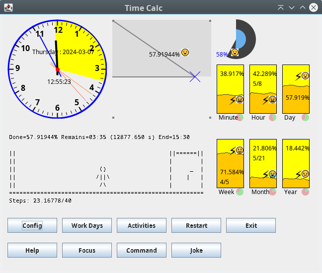

# Time Calc

## Introduction

Time Calc is a desktop application used to track the remaining time until the end of some activity - like working hours.

_Time Calc is written in Java programming language and uses the Swing framework._

## Usage

### Start of application

When "Time Calc" is started", user is asked for:
 - start time ... like 7:30
 - overtime ... like 0:45 ... overtime is optional and the default value is 0:00

### Restart of application

You can restart the app, if you press the **"Restart"** button.
 - Then you are asked again for start time and overtime.

### End of application

You can stop the app, if you press the **"Exit"** button or click on the exit window button.
- Then application is stopped.

## Special files

If these files are present, something special happens.

### starttime.txt

This file contains the default start time - used during the previous run of the app. 
If file starttime.txt does not exist, then the default start time is 7:00.

### overtime.txt

This file contains the default overtime - used during the previous run of the app.
If file overtime.txt does not exist, then the default overtime is 0:00.

### test.txt
If file test.txt exists, then user is not asked for start time and overtime. Instead, the values in files starttime.txt and overtime.txt are used.

## Features

### 3 Visibility modes

 * STRONGLY_COLORED - many colors 
 * WEAKLY_COLORED - darkened colors
 * GRAY - gray colors
 * NONE - widgets are hidden

### Widgets

#### Analog Clock

 * hour hand
 * minute hand (can be disabled in configuration)
 * second hand (can be disabled in configuration)
 * millisecond hand  (can be disabled in configuration)
 * shows current year, month, day of month and day of week, if analog clock is hovered by mouse cursor and Visibility is STRONGLY_COLORED
 * shows yellow highlighted remaining time until end of today working hours, if analog clock is hovered by mouse cursor and Visibility is STRONGLY_COLORED
 * hands can be long or shorter (can be set in configuration)

#### Progress Square
 * Show graphically day progress

#### Progress Circle

 * Show graphically day progress

#### Hour Battery

#### Day Battery

#### Week Battery

#### Month Battery

### Smileys

Progress in square, circle or batteries is represented also by smileys (only, if the widget is hovered by mouse cursor):

* ? ... face screaming in fear ... less than 6.25%
* ? ... pouting face ... less than 12.5%
* ? ... angry face ... less than 18.75%
* ? ... loudly crying face ... less than 25%
* ? ... crying face ... less than 31.25%
* ? ... disappointed face ... less than 37.5%
* ? ... tired face ... less than 43.75%
* ? ... fearful face ... less than 50%
* ? ... astonished face ... less than 56.25%
* ? ... frowning face with open mouth ... less than 62.5%
* ? ... smiling face with smiling eyes ... less than 68.75%
* ? ... smiling face with open mouth ... less than 75%
* ? ... grinning face with smiling eyes ... less than 81.25%
* ? ... smiling face with sunglasses ... less than 87.5%
* ? ... smiling face with heart-shaped eyes ... less than 93.75%
* ? ... smiling face with horns ... more or equal to 93.75%

## Key shortcuts

## Command button

## Todos

 * Config window
 * Split to Maven modules
 * Junit, Mockito, etc.
 * Checkstyle
 * Sonarlint
 * Sonarqube
 * Add SQLite support and store times of arrivals and departures and time of activities

