# Time Calc

## Introduction

Time Calc is a desktop application used to track the remaining time until the end of some activity - like working hours.

_Time Calc is written in Java programming language and uses the Swing framework._

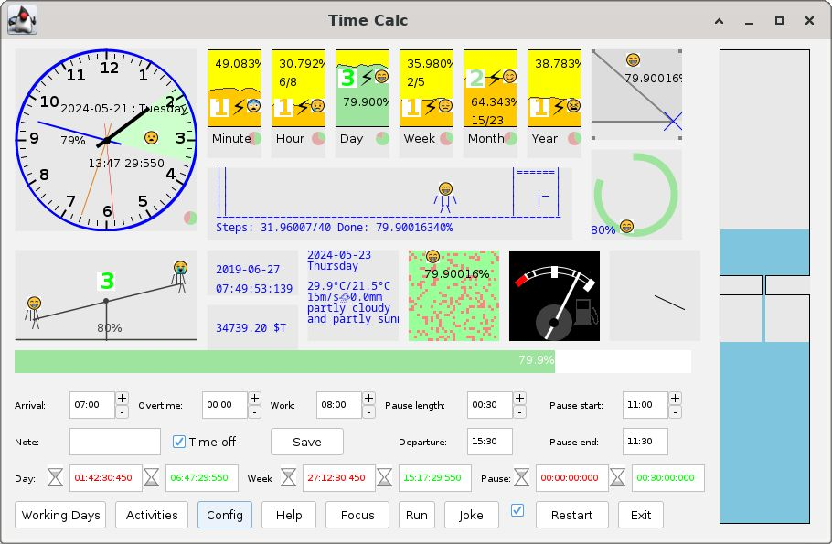

Time Calc is inspired by this document: [report.ods](https://code.nanoboot.org/nanoboot/time-calc/raw/branch/rvc/report.ods)

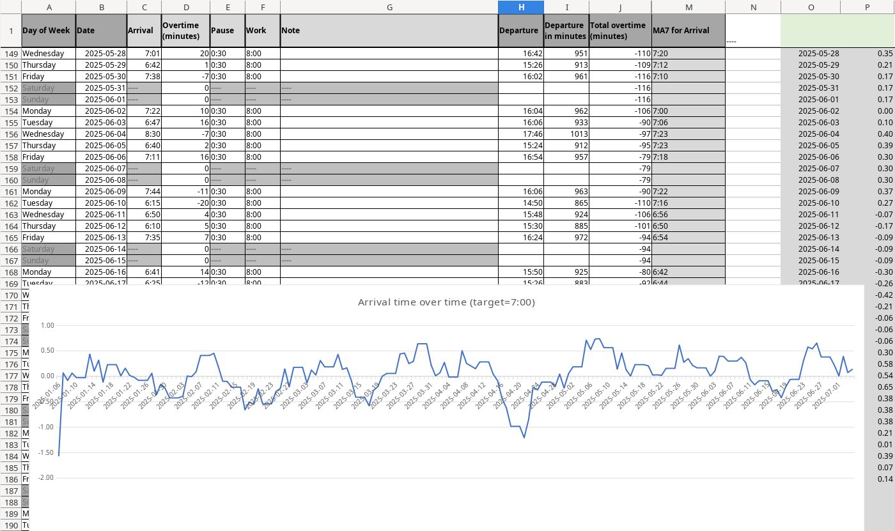

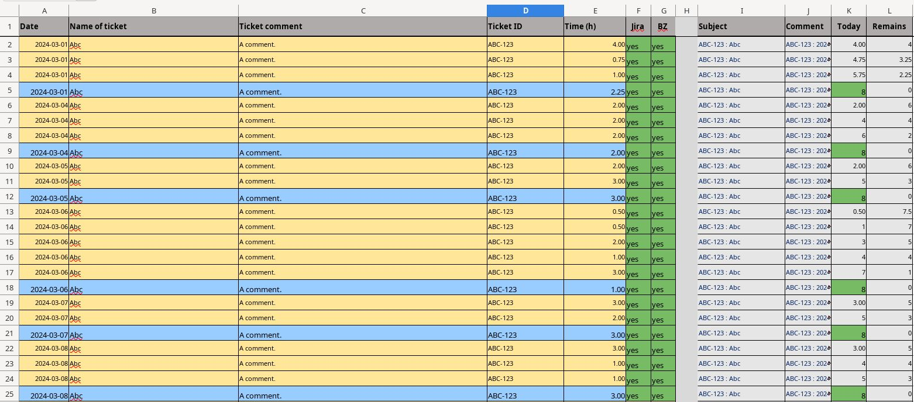

### Screenshots

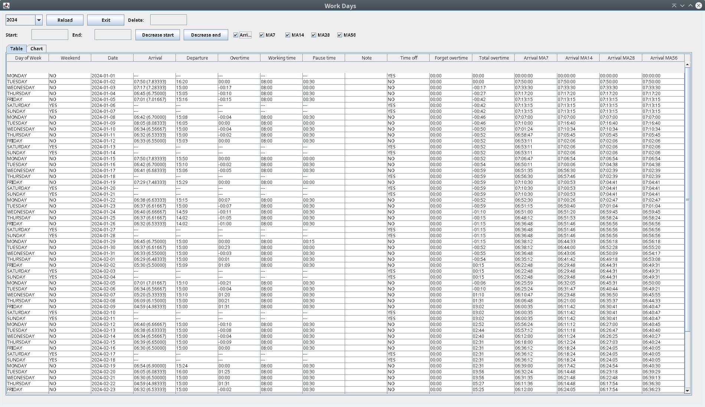

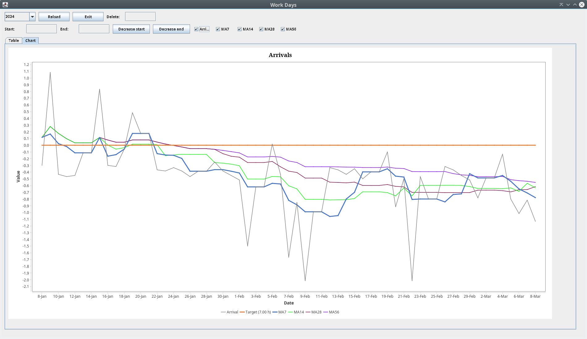

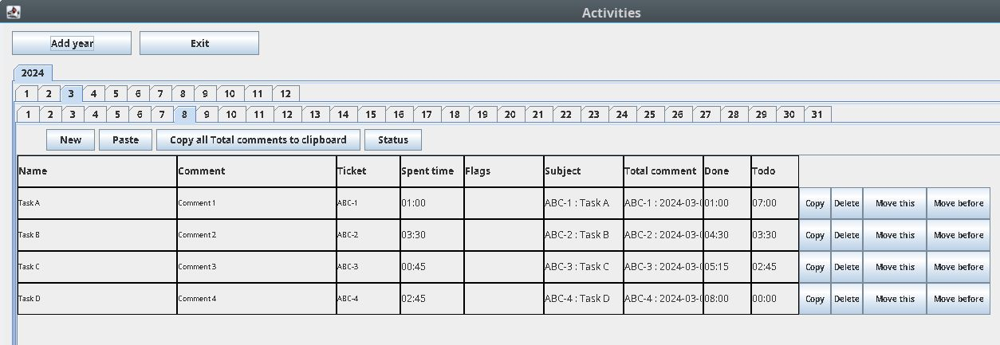

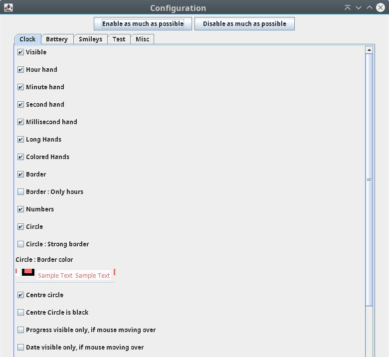

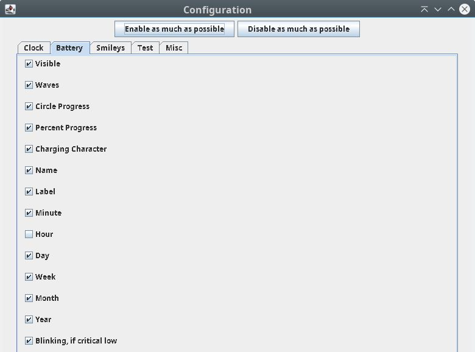

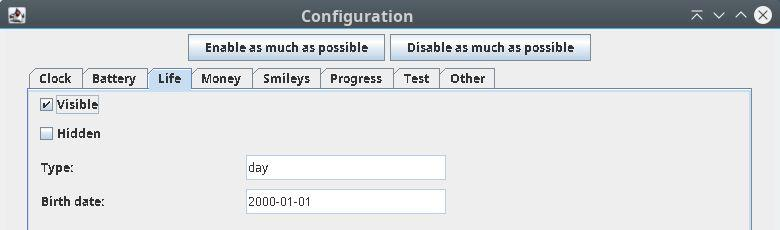

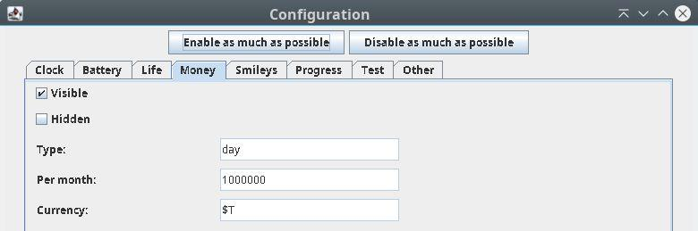

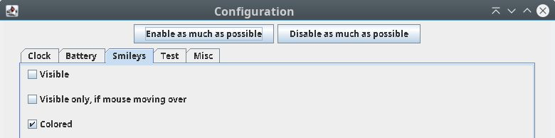

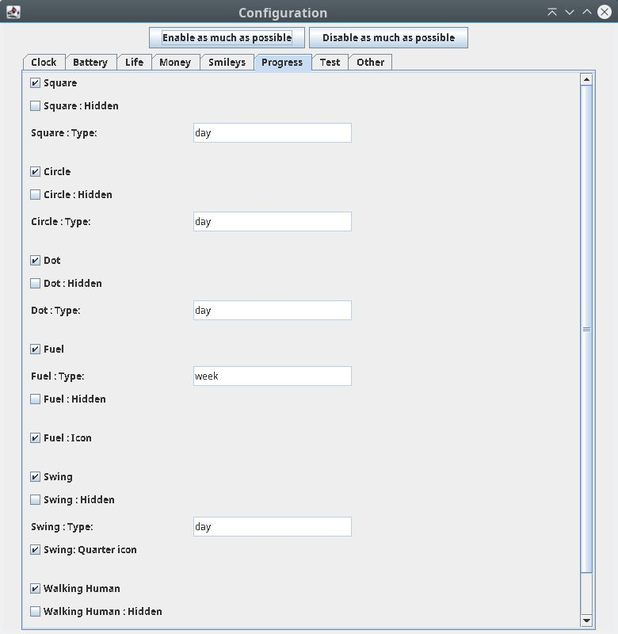

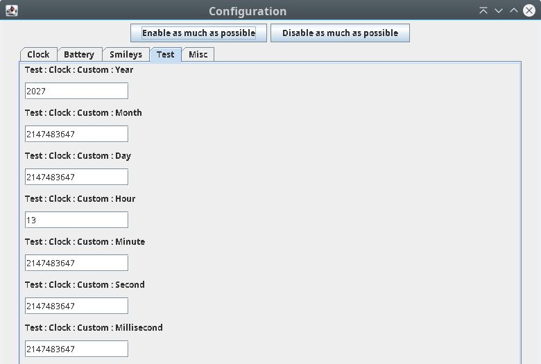

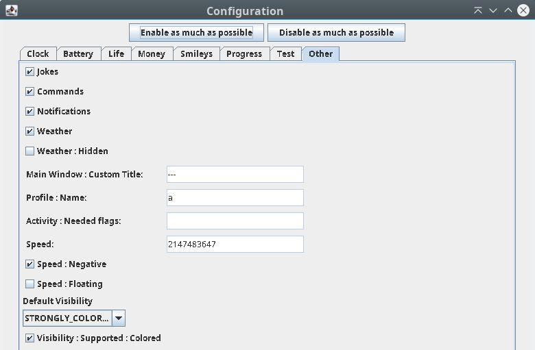

## Usage

### Start of application

When "Time Calc" is started", user is asked for:
 - start time ... like 7:30
 - overtime ... like 0:45 ... overtime is optional and the default value is 0:00

### Restart of application

You can restart the app, if you press the **"Restart"** button.
 - Then you are asked again for start time and overtime.

### End of application

You can stop the app, if you press the **"Exit"** button or click on the exit window button.
- Then application is stopped.

## Special files

If these files are present, something special happens.

### ./tc/timecalc.conf

Configuration is stored here.

### ./tc/timecalc.{profile name}.conf

Configuration for a profile is stored here.

### ./tc/time-calc-current-profile.txt

Current profile is stored here.

### ./tc/time-calc-profiles.txt

Optional assignments of profiles to numbers is stored here.

## Features

### 4 Visibility modes

 * STRONGLY_COLORED - many colors 
 * WEAKLY_COLORED - darkened colors
 * GRAY - gray colors
 * NONE - widgets are hidden

### Widgets

#### Analog Clock

 * hour hand
 * minute hand (can be disabled in configuration)
 * second hand (can be disabled in configuration)
 * millisecond hand  (can be disabled in configuration)
 * shows current year, month, day of month and day of week, if analog clock is hovered by mouse cursor and Visibility is STRONGLY_COLORED
 * shows yellow highlighted remaining time until end of today working hours, if analog clock is hovered by mouse cursor and Visibility is STRONGLY_COLORED
 * hands can be long or shorter (can be set in configuration)

#### Progress Square
 * Show graphically day progress

#### Progress Circle

 * Show graphically day progress

#### Hour Battery

#### Day Battery

#### Week Battery

#### Month Battery

### Smileys

Progress in square, circle or batteries is represented also by smileys (only, if the widget is hovered by mouse cursor):

Smileys can be colored or white-black (can be set in configuration)

<pre>&#x1f631;</pre> ... face screaming in fear ... less than 6.25%

<pre>&#x1f621;</pre> ... pouting face ... less than 12.5%

<pre>&#x1f620;</pre> ... angry face ... less than 18.75%

<pre>&#x1f62d;</pre> ... loudly crying face ... less than 25%

<pre>&#x1f622;</pre> ... crying face ... less than 31.25%

<pre>&#x1f61e;</pre> ... disappointed face ... less than 37.5%

<pre>&#x1f62b;</pre> ... tired face ... less than 43.75%

<pre>&#x1f628;</pre> ... fearful face ... less than 50%

<pre>&#x1f632;</pre> ... astonished face ... less than 56.25%

<pre>&#x1f626;</pre> ... frowning face with open mouth ... less than 62.5%

<pre>&#x1f60a;</pre> ... smiling face with smiling eyes ... less than 68.75%

<pre>&#x1f603;</pre> ... smiling face with open mouth ... less than 75%

<pre>&#x1f601;</pre> ... grinning face with smiling eyes ... less than 81.25%

<pre>&#x1f60e;</pre> ... smiling face with sunglasses ... less than 87.5%

<pre>&#x1f60d;</pre> ... smiling face with heart-shaped eyes ... less than 93.75%

<pre>&#x1f608;</pre> ... smiling face with horns ... more or equal to 93.75%

## Key shortcuts

* UP - Show widgets again, if they were hidden
* DOWN or PERIOD - Hide all widgets and buttons
* H - Show all hide everything
* G - switch between coloured and no-coloured visibility mode
* C - switch between strongly coloured and weakly coloured visibility mode
* V - switch visibility mode NONE and STRONGLY_COLOURED
* SPACE - switch visibility mode: NONE, GREY, WEAKLY_COLOURED, STRONGLY_COLOURED
* F2 - run commands
* R - restart app
* N - enable or disable notifications
* W - open work days window
* A - open activity window
* S - open config window
* P or F1 - open help window
* X - exit application
* J - show random Joke
* U - enable everything
* I - disable almost everything
* E - enable or disable battery waves
* B - hide or show buttons
* 0,1,2,3,4,5,6,7,8 or 9 - activates a profile
* F - show numbers for profiles
* Q - hide or show progress square
* L - hide or show progress circle
* M - hide or show walking human
* Y - hide or show smileys
* Z - set forget overtime
* LEFT - switch to previous profile
* RIGHT - switch to next profile
* K - hide or show clock
* SHIFT + {Y,N,D,H,M,S,I,K} - Increase test time value
* CTRL + {Y,N,D,H,M,S,I,K} - Decrease test time value
* ALT + {Y,N,D,H,M,S,I,K} - Reset test time value
* Y=year, N=month, D=day of month, H=hour, M=minute, S=second, I=millisecond, K=week
* SHIFT + Q - Increase speed of time
* CTRL + Q - Decrease speed of time
* ALT + Q - Reset speed of time
* COMMA - Switch between foreward and backward speed
* T - Enable or disable floating speed
* D - Reset custom time values to the real time
* SHIFT + A - Increase arrival time
* CTRL + A - Decrease arrival time
* SHIFT + O - Increase overtime
* CTRL + O - Decrease overtime
* SHIFT + W - Increase working time
* CTRL + W - Decrease working time
* SHIFT + P - Increase pause
* CTRL + P - Decrease pause
* SHIFT + C - Increase or decrease of time is change by 1 hour
* CTRL + C - Increase or decrease of time is change by 1 minute
* CTRL + E - Save arrival, overtime, working time, pause time and note
* O - Disable many features, let enable only the basic features of "Time Calc" application.

## Command button

## Todos

### New features

 * Custom arrival target
 * Split to Maven modules
 * Junit, Mockito, etc.
 * Checkstyle
 * Sonarlint
 * Sonarqube

### Fix these known bugs

* Clock, square and circle are grey, if visibility mode is weakly colored.

## For Developers

### How to add new property

**Change these places:**

* timecalc-default.conf
* TimeCalcProperty
* TimeCalcConfiguration
* ConfigWindow
* Widget class
* MainWindow - bind

